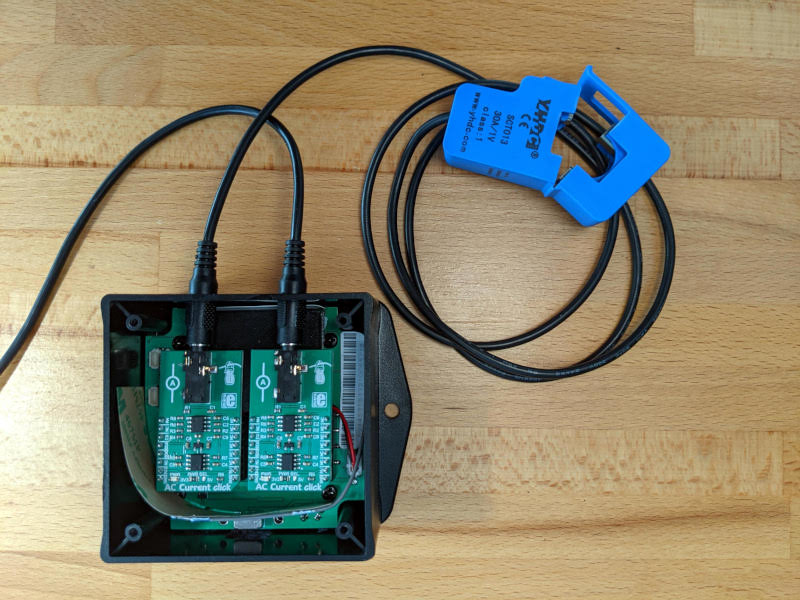

..
   Copyright (c) 2022-2023 Golioth, Inc.
   SPDX-License-Identifier: Apache-2.0

Golioth AC Power Monitor Reference Design
#########################################

Overview
********

The Golioth AC Power Monitor reference design includes two channels for
monitoring electrical equipment. Whether applied to machine tools on a
production floor, or the electrical circuits in a commercial/residential
setting, having data about electrical usage is a powerful tool for making
business decisions.

Readings from each channel are passed up to Golioth for tracking usage over
time. Live "run" time is also reported to show how long a machine has currently
been running. This data is also used to report the lifetime "run" time of the
equipment being monitored. The delay between readings and the threshold at
which the equipment is considered "off" are configurable from the Golioth cloud.

Local set up
************

.. pull-quote::
   [!IMPORTANT]

   Do not clone this repo using git. Zephyr's ``west`` meta tool should be used to
   set up your local workspace.

Install the Python virtual environment (recommended)
====================================================

.. code-block:: shell

   cd ~
   mkdir golioth-reference-design-ac-power-monitor
   python -m venv golioth-reference-design-ac-power-monitor/.venv
   source golioth-reference-design-ac-power-monitor/.venv/bin/activate
   pip install wheel west

Use ``west`` to initialize and install
======================================

.. code-block:: shell

   cd ~/golioth-reference-design-ac-power-monitor
   west init -m git@github.com:golioth/reference-design-ac-power-monitor.git .
   west update
   west zephyr-export
   pip install -r deps/zephyr/scripts/requirements.txt

Building the application
************************

Build the Zephyr sample application for the `Nordic nRF9160 DK`_
(``nrf9160dk_nrf9160_ns``) from the top level of your project. After a
successful build you will see a new ``build`` directory. Note that any changes
(and git commits) to the project itself will be inside the ``app`` folder. The
``build`` and ``deps`` directories being one level higher prevents the repo from
cataloging all of the changes to the dependencies and the build (so no
``.gitignore`` is needed).

Prior to building, update ``VERSION`` file to reflect the firmware version number you want to assign
to this build. Then run the following commands to build and program the firmware onto the device.

.. pull-quote::
   [!IMPORTANT]

   You must perform a pristine build (use ``-p`` or remove the ``build`` directory)
   after changing the firmware version number in the ``VERSION`` file for the change to take effect.

.. code-block:: text

   $ (.venv) west build -p -b nrf9160dk/nrf9160/ns --sysbuild app
   $ (.venv) west flash

Configure PSK-ID and PSK using the device shell based on your Golioth
credentials and reboot:

.. code-block:: text

   uart:~$ settings set golioth/psk-id <my-psk-id@my-project>
   uart:~$ settings set golioth/psk <my-psk>
   uart:~$ kernel reboot cold

Add Pipeline to Golioth
***********************

Golioth uses `Pipelines`_ to route stream data. This gives you flexibility to change your data
routing without requiring updated device firmware.

Whenever sending stream data, you must enable a pipeline in your Golioth project to configure how
that data is handled. Add the contents of ``pipelines/cbor-to-lightdb.yml`` as a new pipeline as
follows (note that this is the default pipeline for new projects and may already be present):

   1. Navigate to your project on the Golioth web console.
   2. Select ``Pipelines`` from the left sidebar and click the ``Create`` button.
   3. Give your new pipeline a name and paste the pipeline configuration into the editor.
   4. Click the toggle in the bottom right to enable the pipeline and then click ``Create``.

All data streamed to Golioth in CBOR format will now be routed to LightDB Stream and may be viewed
using the web console. You may change this behavior at any time without updating firmware simply by
editing this pipeline entry.

Golioth Features
****************

This app implements:

* Over-the-Air (OTA) firmware updates
* LightDB State for tracking live runtime and cumulative runtime
* LightDB Stream for recording periodic readings from each channel
* Settings Service to adjust the delay between sensor readings and the ADC
  floor ("off" threshold above which a device will be considered "running")
* Remote Logging
* Remote Procedure call (RPC) to reboot the device or set logging levels

Settings Service
================

The following settings should be set in the Device Settings menu of the
`Golioth Console`_.

``LOOP_DELAY_S``
   Adjusts the delay between sensor readings. Set to an integer value (seconds).

   Default value is ``60`` seconds.

``ADC_FLOOR_CH0`` (raw ADC value)

``ADC_FLOOR_CH1`` (raw ADC value)

   Filter out noise by adjusting the minimum reading at which a channel will be
   considered "on".

   Default values are ``0``

Remote Procedure Call (RPC) Service
===================================

The following RPCs can be initiated in the Remote Procedure Call menu of the
`Golioth Console`_.

``get_network_info``
   Query and return network information.

``reboot``
   Reboot the system.

``set_log_level``
   Set the log level.

   The method takes a single parameter which can be one of the following integer
   values:

   * ``0``: ``LOG_LEVEL_NONE``
   * ``1``: ``LOG_LEVEL_ERR``
   * ``2``: ``LOG_LEVEL_WRN``
   * ``3``: ``LOG_LEVEL_INF``
   * ``4``: ``LOG_LEVEL_DBG``

LightDB State and LightDB Stream data
=====================================

Time-Series Data (LightDB Stream)
---------------------------------

Raw Current data for both channels is reported as time-series data on the ``sensor`` endpoint.
There readings can each be multiplied by 0.00125 to convert the values to Amps.

.. code-block:: json

   {
     "sensor": {
          "ch0": 11,
          "ch1": 447
       }
   }

If your board includes a battery, voltage and level readings will be sent to the ``battery``
endpoint.

Stateful Data (LightDB State)
-----------------------------

The concept of Digital Twin is demonstrated with the LightDB State via the ``desired`` and
``actual`` endpoints.

.. code-block:: json

   {
     "desired": {
       "reset_cumulative": false
     },
     "state": {
       "cumulative": {
         "ch0": 138141,
         "ch1": 1913952
       },
       "live_runtime": {
         "ch0": 0,
         "ch1": 913826
       }
     }
   }

* ``desired.reset_cumulative`` values may be changed from the cloud side. The device will recognize
  when this endpoint is set to ``true``, clearing the stored ``cumulative`` values and writing the
  ``reset_cumulative`` value to ``false`` to indicate the operation was completed.

* ``actual`` values will be updated by the device. The cloud may read the ``actual`` endpoints to
  determine device status, but only the device should ever write to the ``actual`` endpoints.

Hardware Variations
*******************

Nordic nRF9160 DK
=================

This reference design may be built for the `Nordic nRF9160 DK`_.

Use the following commands to build and program. (Use the same console commands
from above to provision this board after programming the firmware.)

.. code-block:: text

   $ (.venv) west build -p -b nrf9160dk/nrf9160/ns --sysbuild app
   $ (.venv) west flash

External Libraries
******************

The following code libraries are installed by default. If you are not using the
custom hardware to which they apply, you can safely remove these repositories
from ``west.yml`` and remove the includes/function calls from the C code.

* `golioth-zephyr-boards`_ includes the board definitions for the Golioth
  Aludel-Mini
* `libostentus`_ is a helper library for controlling the Ostentus ePaper
  faceplate
* `zephyr-network-info`_ is a helper library for querying, formatting, and returning network
  connection information via Zephyr log or Golioth RPC

.. _the Golioth DC Power Monitor project page: https://projects.golioth.io/reference-designs/iot-ac-power-monitor/
.. _Golioth Console: https://console.golioth.io
.. _Nordic nRF9160 DK: https://www.nordicsemi.com/Products/Development-hardware/nrf9160-dk
.. _Pipelines: https://docs.golioth.io/data-routing
.. _the Golioth Docs OTA Firmware Upgrade page: https://docs.golioth.io/firmware/golioth-firmware-sdk/firmware-upgrade/firmware-upgrade
.. _golioth-zephyr-boards: https://github.com/golioth/golioth-zephyr-boards
.. _libostentus: https://github.com/golioth/libostentus
.. _zephyr-network-info: https://github.com/golioth/zephyr-network-info
